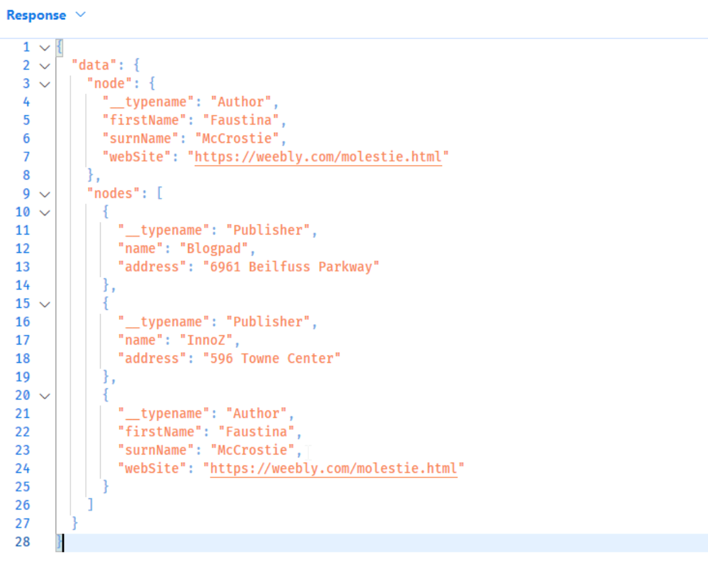

# Relay

Relay is a powerful abstraction for building client applications that use GraphQL. It was born as a Javascript client released by Facebook in conjunction with GraphQL.
It is based on three assumptions that the client expects to be implemented by the GraphQL server:

- **Connection**: a method that simplifies the paging of lists and the creation of relationships
- **Global Object identification**: a method for identifying objects globally
- **Mutations**: a specific way to manage mutations


## Pagination: Connections
Relay manages pagination according to a "Cursor-based" approach; in this approach, the concept of page does not exist, but the only information that the client knows is the previous or subsequent block of items, in this mode the performance problems (typical of the "Offset-based" mode) are canceled.
Relay calls paged lists **Connections**. A Connection returns a type that exposes two fields:

- `edges`: contains the required data with metadata about the cursor position of the extracted nodes.
- `pageInfo`: contains metadata related to the query
- `nodes`: contains nodes flattened with respect to the `edge` view

```graphql
query editori {
    page1: publishers(first: 10) {
      edges {
        cursor
        node {
          id
          name
        }
      }
      nodes {
        id
        name
      }
      pageInfo {
        endCursor
      }
    }
    page2: publishers(first: 10, after: "OQ==") {
      nodes {
        id
        name
      }
    }
}
```

It is possible to extend the fields returned by Connection and Edge types. The library allows eg. to extend the connections by adding a field often useful in paginations: the `totalCount`:

```csharp
[UsePaging(IncludeTotalCount = true)]
```

## Filtering and Sorting

GraphQL and Hotchocolate provide a very effective implementation for [Filtering](https://chillicream.com/docs/hotchocolate/fetching-data/filtering) and [Sorting](https://chillicream.com/docs/hotchocolate/fetching-data/sorting):

```graphql
query autori {
    authors (where: {
      and: { 
        firstName: { startsWith: "R" } 
        surnName: { startsWith: "B"}
        }
    }
    order: {
      firstName: ASC
    }){
      nodes {
      id
      firstName
      surnName
      }
    }
}
```

## Global Object identification

The idea behind Global Object Identification (GOI) is that a GraphQL client should be able to retrieve any "node" given a unique identifier.
A large part of the reason for the GOI is **client-side caching**. GraphQL clients often create complex normalized caches to store nodes they have previously fetched.
Relay, for example, needs a mechanism to retrieve individual nodes and a convention that allows the client to do so without too much configuration.

It is important to underline that the GOI is by no means a constraint to be compulsorily implemented, but a "good practice", especially if you use clients adhering to the Relay specifications.

An important part of these ids (similar to what should be done for REST URIs), is that users don't have to try to create or hack their own IDs, they just use the IDs they get directly from the API. A good way to make sure this happens is to use opaque identifiers, for example, by encoding them in Base64.

To enable [GOI in Hotchocolate](https://chillicream.com/docs/hotchocolate/defining-a-schema/relay/#global-identifiers) you need to:

1. add the GOI between the services, using `builder.Services.AddGlobalObjectIdentification()`: register the `Node` interface and, in the query type, add the fields:
   - `node(id: ID!): Node`
   - `nodes(ids: [ID!]!): [Node]!`

   At least one type in our schema must implement the `Node` interface, otherwise an exception is thrown
2. Extend our Object Type with GOI functionality: eg.

```graphql
    public class AuthorType : ObjectType<Author>
    {
        protected override void Configure(IObjectTypeDescriptor<Author> descriptor)
        {
            descriptor
                .ImplementsNode()
                .IdField(f => f.Id)
                .ResolveNode(async (ctx, id) => {
                    var author = await ctx.Service<IMongoCollection<Author>>().Find(x => x.Id == id).FirstOrDefaultAsync();
                    return author;
                });
        }
    }
```

To see the result you can run the following GraphQL queries:

```graphql
query firstFetch{
  authorById(id: "2d2cbbee-5a3a-4102-bc41-04679bfa2968") {
    id
  }
  publishers(first:5) {
    nodes {
      id
    }
  }
}

query reFetch {
  node(id: "QXV0aG9yCmQyZDJjYmJlZS01YTNhLTQxMDItYmM0MS0wNDY3OWJmYTI5Njg=") {
    __typename
    ... on Author {
      firstName
      surnName
      webSite
    }
  }  
  nodes(ids: [
    "UHVibGlzaGVyCmQxOTE3ZTJjZi00NDJhLTRhMmYtYTdjNS1iOGQ1YmQ2NDVkMGQ=",
    "UHVibGlzaGVyCmQ4ZDYxY2U0OS0xYjY5LTQxN2ItYjNjMS1mZDhhNzE2OTAyNTA=",
    "QXV0aG9yCmQyZDJjYmJlZS01YTNhLTQxMDItYmM0MS0wNDY3OWJmYTI5Njg="
  ]) {
    __typename
    ... on Publisher {
      name
      address
    }
    ... on Author {
      firstName
      surnName
      webSite
    }
  }
}
```

the result is the following:


