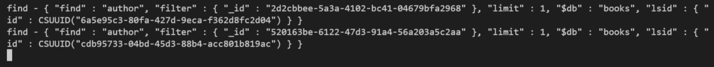
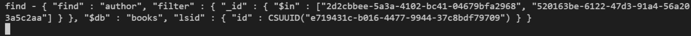

# Data Loaders

Let's start with the problem. N + 1. Let's look at this query

```graphql
query autore {
    a1: authorById(id: "2d2cbbee-5a3a-4102-bc41-04679bfa2968") {
      firstName
      surnName
      webSite
      email
    }

    a2: authorById(id: "520163be-6122-47d3-91a4-56a203a5c2aa") {
      firstName
      surnName
      webSite
      email
    }    
}
```
 if we check the console logs we will find something like this:



That is, a different query for each requested resource.

Why does this happen?

Because the `resolvers` are atomic and have no awareness of the query being executed as a whole. To solve this problem **DataLoaders** come to the rescue.

The dataloaders constitute a separation layer between the resolvers and the persistence layer from which the data is extracted: instead of calling the repositories directly to read the data, the resolvers call the dataloaders which are able to group requests together to perform a query only.

  By introducing dataloaders, queries can be optimized to produce the following result:



 Now let's take a slightly more complex query:

 ```
 query {
  books(first:1, where: {title: { startsWith: "Reconstituirea"}}) {
    nodes {
      id
      title
      authors {
        firstName
        surnName
      }
      relatedBooks {
        title
        publicationDate
        relatedBooks {
          title
        }
      }
    }
  }
}
 ```

 If we check the query output before introducing the dataloaders we would see a log like this:

 ```bash
 # query to filter book
 find - { "find" : "book", "filter" : { "Title" : { "$regex" : /^Reconstituirea/ } }, "projection" : { "RelatedBooks.RelatedBooks.Title" : 1, "RelatedBooks.PublicationDate" : 1, "RelatedBooks.Title" : 1, "Authors.SurnName" : 1, "Authors.FirstName" : 1, "Title" : 1, "_id" : 1 }, "limit" : 2, "$db" : "books", "lsid" : { "id" : CSUUID("b8a46b06-4e22-4377-b381-9ed2cb9bda87") } }
# query to re-fetch the same book to project the related books
 find - { "find" : "book", "filter" : { "_id" : "75f31668-f348-4aa0-88c9-d186e0a6fe4e", "RelatedBooks" : { "$ne" : null } }, "projection" : { "RelatedBooks" : 1, "_id" : 0 }, "limit" : 1, "$db" : "books", "lsid" : { "id" : CSUUID("b8a46b06-4e22-4377-b381-9ed2cb9bda87") } }
# query to re-fetch the same book to project the book's authors
find - { "find" : "book", "filter" : { "_id" : "75f31668-f348-4aa0-88c9-d186e0a6fe4e" }, "projection" : { "Authors" : 1, "_id" : 0 }, "limit" : 1, "$db" : "books", "lsid" : { "id" : CSUUID("53c4917d-21b7-462a-b1f9-366798c6fbee") } }
# query for 2nd-level depth books
find - { "find" : "book", "filter" : { "_id" : { "$in" : ["6fed258d-b0e7-4b7c-a0bc-2890a94bc8b9", "b562b54c-ed12-4013-ab9e-3c575e4a4819", "f6b7de8f-1d0d-4188-aec8-f122fadbb54f"] } }, "$db" : "books", "lsid" : { "id" : CSUUID("b8a46b06-4e22-4377-b381-9ed2cb9bda87") } }
# queries for book's authors
find - { "find" : "author", "filter" : { "_id" : { "$in" : ["5f052310-0dff-40e7-8cc0-0a13b6d8980b", "f01ad119-349a-4c7a-9fb8-dc0141a14397"] } }, "$db" : "books", "lsid" : { "id" : CSUUID("53c4917d-21b7-462a-b1f9-366798c6fbee") } }
# queries for 3rd-level depth books + query to re-fetch the same books to project the related books
find - { "find" : "book", "filter" : { "_id" : "f6b7de8f-1d0d-4188-aec8-f122fadbb54f", "RelatedBooks" : { "$ne" : null } }, "projection" : { "RelatedBooks" : 1, "_id" : 0 }, "limit" : 1, "$db" : "books", "lsid" : { "id" : CSUUID("b8a46b06-4e22-4377-b381-9ed2cb9bda87") } }
find - { "find" : "book", "filter" : { "_id" : "b562b54c-ed12-4013-ab9e-3c575e4a4819", "RelatedBooks" : { "$ne" : null } }, "projection" : { "RelatedBooks" : 1, "_id" : 0 }, "limit" : 1, "$db" : "books", "lsid" : { "id" : CSUUID("53c4917d-21b7-462a-b1f9-366798c6fbee") } }
find - { "find" : "book", "filter" : { "_id" : { "$in" : ["c38fb111-05ac-420a-a55b-a8d1dc7b3907", "f12fe59d-4409-4a18-bd91-8dd975f181ec", "c67750e2-3ac4-420f-b0be-a226c68294e2", "450c03b2-8e28-4373-b17a-0f49e70630d8", "60006eb0-8ca5-4d2c-acf5-58c864ccc81d", "64d917d4-eee3-4a87-948f-ad41ce91cd02"] } }, "$db" : "books", "lsid" : { "id" : CSUUID("b8a46b06-4e22-4377-b381-9ed2cb9bda87") } }  
find - { "find" : "book", "filter" : { "_id" : "6fed258d-b0e7-4b7c-a0bc-2890a94bc8b9", "RelatedBooks" : { "$ne" : null } }, "projection" : { "RelatedBooks" : 1, "_id" : 0 }, "limit" : 1, "$db" : "books", "lsid" : { "id" : CSUUID("02f48248-d9df-4305-a9a0-f85b0589f0a8") } }
find - { "find" : "book", "filter" : { "_id" : { "$in" : ["602cb84e-e5c2-4c50-8cd9-d6837a189464", "40cdeae3-f803-40e7-aba3-cb6efbcdc771", "081fbec1-edcd-4d2b-b326-10ba7d0d8c7f", "1b302baf-cf78-4f54-b731-e3121d31824d", "508233c0-59ed-42f9-b21f-6f70de0ed381", "31c3efd2-a5a7-47b5-a151-17c0cd531026"] } }, "$db" : "books", "lsid" : { "id" : CSUUID("53c4917d-21b7-462a-b1f9-366798c6fbee") } }  
find - { "find" : "book", "filter" : { "_id" : { "$in" : ["5423e2fa-0239-45fb-862e-2e8bf5527e87", "fe38819a-4d11-4d26-86d1-14396c99c282", "da8d20ff-c690-4e76-b5b4-0353431f7697", "65b30913-4a42-4c1e-8386-3032528dd762", "37f64f6a-b8cc-409b-863d-bbe939e51113"] } }, "$db" : "books", "lsid" : { "id" : CSUUID("02f48248-d9df-4305-a9a0-f85b0589f0a8") } }
 ```

 while after introducing the dataloaders the situation becomes:
 ```bash
 # query to filter book
 find - { "find" : "book", "filter" : { "Title" : { "$regex" : /^Reconstituirea/ } }, "projection" : { "relatedBooks2.relatedBooks2.Title" : 1, "relatedBooks2.PublicationDate" : 1, "relatedBooks2.Title" : 1, "authors2.SurnName" : 1, "authors2.FirstName" : 1, "Title" : 1, "_id" : 1 }, "limit" : 2, "$db" : "books", "lsid" : { "id" : CSUUID("1d93e8b7-fc1e-4b2e-8868-9c11323f6675") } }        
# query to re-fetch the same book (for complete data)
find - { "find" : "book", "filter" : { "_id" : { "$in" : ["75f31668-f348-4aa0-88c9-d186e0a6fe4e"] } }, "$db" : "books", "lsid" : { "id" : CSUUID("1d93e8b7-fc1e-4b2e-8868-9c11323f6675") } }
# query for 2nd-level depth books
find - { "find" : "book", "filter" : { "_id" : { "$in" : ["6fed258d-b0e7-4b7c-a0bc-2890a94bc8b9", "b562b54c-ed12-4013-ab9e-3c575e4a4819", "f6b7de8f-1d0d-4188-aec8-f122fadbb54f"] } }, "$db" : "books", "lsid" : { "id" : CSUUID("1d93e8b7-fc1e-4b2e-8868-9c11323f6675") } }
# queries for book's authors
find - { "find" : "author", "filter" : { "_id" : { "$in" : ["5f052310-0dff-40e7-8cc0-0a13b6d8980b", "f01ad119-349a-4c7a-9fb8-dc0141a14397"] } }, "$db" : "books", "lsid" : { "id" : CSUUID("1d93e8b7-fc1e-4b2e-8868-9c11323f6675") } }
# query for 3nd-level depth books
find - { "find" : "book", "filter" : { "_id" : { "$in" : ["c38fb111-05ac-420a-a55b-a8d1dc7b3907", "f12fe59d-4409-4a18-bd91-8dd975f181ec", "c67750e2-3ac4-420f-b0be-a226c68294e2", "450c03b2-8e28-4373-b17a-0f49e70630d8", "60006eb0-8ca5-4d2c-acf5-58c864ccc81d", "64d917d4-eee3-4a87-948f-ad41ce91cd02", "602cb84e-e5c2-4c50-8cd9-d6837a189464", "40cdeae3-f803-40e7-aba3-cb6efbcdc771", "081fbec1-edcd-4d2b-b326-10ba7d0d8c7f", "1b302baf-cf78-4f54-b731-e3121d31824d", "508233c0-59ed-42f9-b21f-6f70de0ed381", "31c3efd2-a5a7-47b5-a151-17c0cd531026", "5423e2fa-0239-45fb-862e-2e8bf5527e87", "fe38819a-4d11-4d26-86d1-14396c99c282", "da8d20ff-c690-4e76-b5b4-0353431f7697", "65b30913-4a42-4c1e-8386-3032528dd762", "37f64f6a-b8cc-409b-863d-bbe939e51113"] } }, "$db" : "books", "lsid" : { "id" : CSUUID("1d93e8b7-fc1e-4b2e-8868-9c11323f6675") } }
 ```