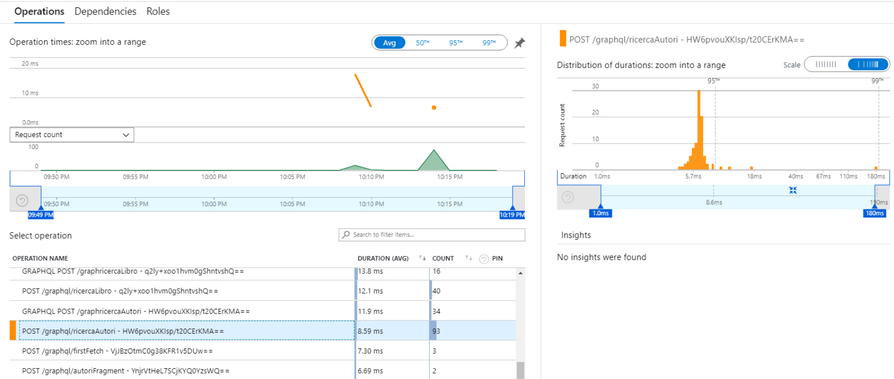
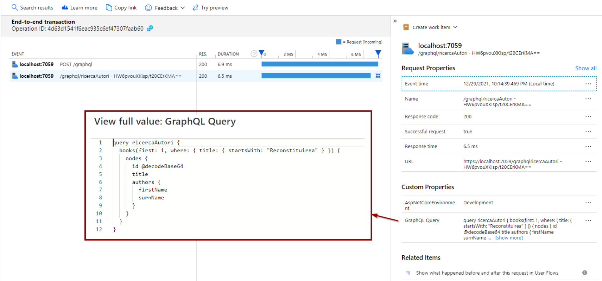

# Monitoring Hotchocolate with Application Insights

Monitoring is the first step for operational and performance controls.
Let's see how to monitor Hotchocolate GraphQL with Application Insights.

## Setup

In order to manage telemetry with Application Insights, you must first install the package for the platform used:

```bash
dotnet add ./graphqlServer package Microsoft.ApplicationInsights.AspNetCore --version 12.1.0
```

An equally important step is to set up your `InstrumentationKey` for Application Insights.

In this project I use [secrets to manage AI keys](https://docs.microsoft.com/en-us/aspnet/core/security/app-secrets?view=aspnetcore-6.0&tabs=windows)


```bash
dotnet user-secrets init --project .\graphqlServer\ 
dotnet user-secrets set "ApplicationInsights:InstrumentationKey" "xxxxxxxxxxxxxxxxx"  --project .\graphqlServer\
```

At this point we are ready to send metrics from Hotchocolate

## Diagnostics in Hotchocolate

The diagnostics in Hotchocolate is very simple, just do:

1. Implement a class derived from `ExecutionDiagnosticEventListener` (see https://github.com/ChilliCream/hotchocolate/issues/1596)
2. Register telemetry and DI for Application Insights

```csharp
builder.Services
    // Monitoring
    .AddApplicationInsightsTelemetry()
    .AddSingleton<IExecutionDiagnosticEventListener, ApplicationInsightsDiagnosticEventListener>()
```

The result allows you to do the required monitoring and very detailed performance analyzes.



and the detail of the single request allows to understand what was requested by the client:

