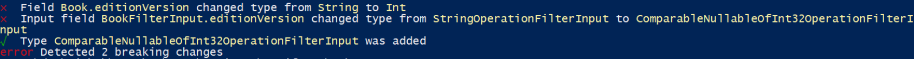

# Tools

One of the really interesting aspects of GraphQL is the growing ecosystem of tools to support the development and maintenance of the GraphQL schema.
Let's see some of them.

## Schema Comparing

An interesting tool is the [graphql-inspector](https://github.com/kamilkisiela/graphql-inspector) which allows you to verify any breacking changes introduced in the evolution of the scheme.

The installation and use of the tool is easy and [documented](https://graphql-inspector.com/docs/installation#usage).

With Hotcholate the generation of the scheme is very easy, just invoke the route:

```
https://localhost:xxxx/graphql?sdl
```

Generating the schema can also be done programmatically

```csharp
var resolver = builder.ApplicationServices.GetService<IRequestExecutorResolver>();
var newSchema = executor.Schema.ToString();
```

In the solution, a step has been introduced during the startup phase that generates a file with the diagram in a project folder.

An example of the comparison result can be seen by running the command:

```bash
graphql-inspector diff schema.v1.graphql schema.graphql
```



## Mock GraphQL API

Another interesting tool is [GraphQL Faker](https://github.com/APIs-guru/graphql-faker)