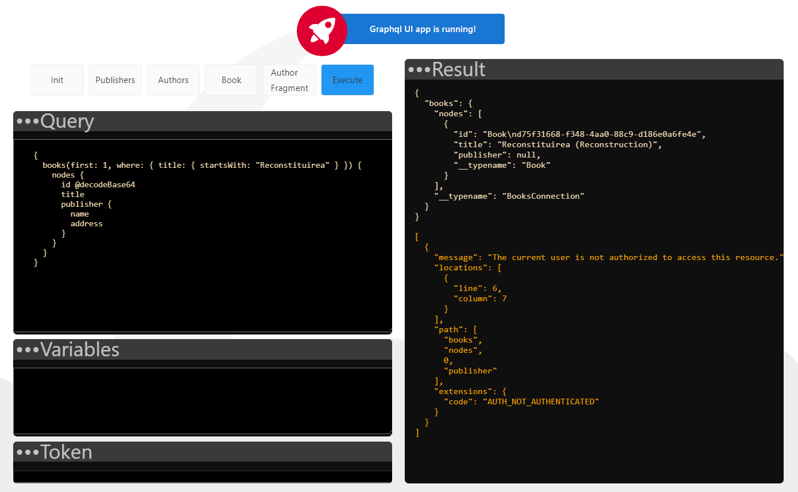

# Apollo Angular Client

Last step of this intro is to create a minimal angular app that can call GraphQL query and display the results. 
For this goal I've used [Apollo Angular](https://apollo-angular.com/docs/) that is the angular version of [Apollo Client](https://www.apollographql.com/docs/react/get-started/).

## Setup

Take the following steps as a guide, but I'm not sure that these steps will reproduce a working app, because compatibilities among npm packages, angular cli, schematics etc. Anyway:

```bash
ng new graphqlUI
cd graphqlUI
npm install apollo-angular @apollo/client graphql 
```

At the moment I write this guide I couldn't use latest version of angular (v. 13.x) because `@apollo/client` is not yet compatible with the latest angular version.

## Configure Apollo Client

In this basic version, I configure the client to connect to the GraphQL server sending authorization header for authentication/authorization.

```typescript
@NgModule({
  ...
  providers: [
    {
      provide: APOLLO_OPTIONS,
      useFactory: (httpLink: HttpLink, tokenService: TokenService) => {
        const http = httpLink.create({uri: 'https://localhost:7059/graphql'});
        const authMiddleware = new ApolloLink((operation, forward) => {
          // add the authorization to the headers
          if(tokenService.token != null) {
            operation.setContext({
              headers: new HttpHeaders().set('Authorization', tokenService.token)
            });
          }

          return forward(operation);
        });

        return {
          cache: new InMemoryCache(),
          link: concat(authMiddleware, http),
        };
      },
      deps: [HttpLink, TokenService],
    },
  ],
  bootstrap: [AppComponent]
})
export class AppModule { }

```

## GraphQL Queries

In a very semplified way, this is all the code to run a graphQL query:

```typescript
this.apollo
    .query({
    query: gql`
    {
        books(first: 1, where: { title: { startsWith: "Reconstituirea" } }) {
            nodes {
                id @decodeBase64
                title
                publisher {
                name
                address
                }
            }
        }
    }
    `,
    errorPolicy: 'all'
    })
    .subscribe((result: any) => {
        this.data = result?.data;
        this.loading = result.loading;
        this.errors = result.errors;
    });
```

this the expected result:



